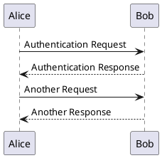
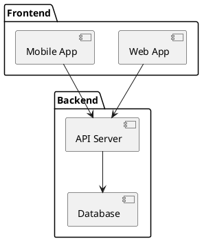
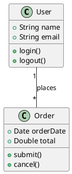
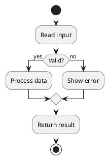
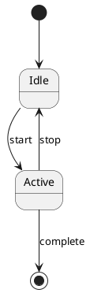
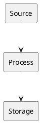
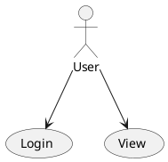

# 

Enhance your documentation with powerful visualization tools including PlantUML diagrams, ASCII art, and inline SVG visualizations.

---

## 🎨 PlantUML Diagrams

PlantUML is a powerful tool for creating UML diagrams from plain text descriptions. Below are examples showing the code and visual representations.


**Note:** To render PlantUML diagrams, you can:
1. Use the PlantUML online server: `https://www.plantuml.com/plantuml/png/[encoded_text]`
2. Install PlantUML locally and generate images
3. Use PlantUML extensions in your IDE
4. Use ASCII representations for simple diagrams (shown below)


---

### Sequence Diagrams

Use sequence diagrams to visualize interactions between different actors or systems:

**PlantUML Code:**


**Visual Representation (ASCII):**
```
┌─────┐                    ┌─────┐
│Alice│                    │ Bob │
└──┬──┘                    └──┬──┘
   │                          │   
   │ Authentication Request   │   
   │─────────────────────────>│   
   │                          │   
   │ Authentication Response  │   
   │<─────────────────────────│   
   │                          │   
   │ Another Request          │   
   │─────────────────────────>│   
   │                          │   
   │ Another Response         │   
   │<─────────────────────────│   
┌──┴──┐                    ┌──┴──┐
│Alice│                    │ Bob │
└─────┘                    └─────┘
```

---

### Component Diagrams

Visualize system architecture and component relationships:

**PlantUML Code:**


**Visual Representation (ASCII):**
```
╔═══════════════════════════════════╗
║          FRONTEND                 ║
║  ┌──────────┐  ┌──────────────┐  ║
║  │ Web App  │  │  Mobile App  │  ║
║  └────┬─────┘  └──────┬───────┘  ║
╚═══════╪════════════════╪═══════════╣
        │                │           
        └────────┐  ┌────┘           
                 ▼  ▼                
        ╔════════════════════╗       
        ║     BACKEND        ║       
        ║  ┌──────────────┐  ║       
        ║  │  API Server  │  ║       
        ║  └──────┬───────┘  ║       
        ║         │           ║       
        ║         ▼           ║       
        ║  ┌──────────────┐  ║       
        ║  │   Database   │  ║       
        ║  └──────────────┘  ║       
        ╚════════════════════╝       
```

---

### Class Diagrams

Document object-oriented design and relationships:

**PlantUML Code:**


**Visual Representation (ASCII):**
```
┌─────────────────────┐              ┌──────────────────────┐
│       User          │              │       Order          │
├─────────────────────┤              ├──────────────────────┤
│ + name: String      │              │ + orderDate: Date    │
│ + email: String     │1           * │ + total: Double      │
├─────────────────────┤──── places ──├──────────────────────┤
│ + login()           │              │ + submit()           │
│ + logout()          │              │ + cancel()           │
└─────────────────────┘              └──────────────────────┘
```

---

### Activity & State Diagrams

**Activity Diagram - PlantUML Code:**


**Activity Diagram - Visual (ASCII):**
```
START
  │
  ▼
┌─────────────┐
│ Read Input  │
└──────┬──────┘
       │
       ▼
   ╔═══════╗
   ║Valid? ║
   ╚═══╤═══╝
   YES │ NO
       │ │
   ┌───▼─┴──────┐
   │   Process  │
   │   or Error │
   └──────┬─────┘
          │
          ▼
   ┌─────────────┐
   │   Return    │
   └──────┬──────┘
          │
         STOP
```

**State Diagram - PlantUML Code:**


**State Diagram - Visual (ASCII):**
```
    ●  (start)
    │
    ▼
┌────────┐
│  Idle  │◀────┐
└───┬────┘     │
    │start    stop
    ▼          │
┌────────┐     │
│ Active │─────┘
└───┬────┘
    │complete
    ▼
    ●  (end)
```

---

## 📊 Advanced Visualization Examples

### System Architecture Diagram

**ASCII Representation:**
```
┌──────────────────────────────────────────────┐
│          System Architecture                 │
└──────────────────────────────────────────────┘

┌─────────────┐         ┌─────────────┐
│   Browser   │────────▶│  API Layer  │
│  (Client)   │◀────────│   (Server)  │
└─────────────┘         └─────────────┘
                               │
                               │
                               ▼
                        ┌─────────────┐
                        │  Database   │
                        │  (Storage)  │
                        └─────────────┘
```

### Data Flow Diagram

**PlantUML Code:**


**ASCII Representation:**
```
User Input → Validation → Processing → Storage → Response

   ┌──────┐     ┌────────┐     ┌────────┐     ┌────────┐     ┌──────┐
   │ User │────▶│Validate│────▶│Process │────▶│ Store  │────▶│Return│
   └──────┘     └────────┘     └────────┘     └────────┘     └──────┘
                    │                                             │
                    │ (Error)                                     │
                    └─────────────────────────────────────────────┘
```

---

## 🎯 Use Case Diagrams

**PlantUML Code:**


**Rendered Output:**


---

## 💡 Best Practices for Diagrams


**Best Practices:**
- Keep diagrams simple and focused on one concept
- Use consistent naming conventions
- Choose the right diagram type for your use case
- Update diagrams when architecture changes
- Add legends when using colors or symbols



**Diagram Types Guide:**
- **Sequence**: Time-based interactions between components
- **Component**: System architecture and module relationships
- **Class**: Object-oriented design and class hierarchies
- **Activity**: Business processes and workflows
- **State**: Lifecycle and state transitions
- **ER Diagrams**: Database schema and table relationships
- **Use Case**: User interactions and system features


---

## 📚 Additional Resources

### PlantUML Rendering Options

1. **Online PlantUML Encoder**: Use the public PlantUML server
   ```
   https://www.plantuml.com/plantuml/png/[encoded_diagram]
   ```

2. **Local Server**: Run your own PlantUML server
   ```bash
   docker run -d -p 8080:8080 plantuml/plantuml-server:jetty
   ```

3. **VS Code Extension**: [PlantUML for VS Code](https://marketplace.visualstudio.com/items?itemName=jebbs.plantuml)
   - Live preview while editing
   - Export to PNG, SVG, PDF
   - Syntax highlighting

### Syntax References

- [PlantUML Official Documentation](https://plantuml.com/)
- [PlantUML Sequence Diagram Guide](https://plantuml.com/sequence-diagram)
- [PlantUML Class Diagram Guide](https://plantuml.com/class-diagram)
- [PlantUML Component Diagram Guide](https://plantuml.com/component-diagram)

### Alternative Tools

- **Mermaid**: Markdown-friendly diagram syntax
- **Draw.io**: Visual diagram editor
- **Graphviz**: Graph visualization software
- **ASCII Flow**: Online ASCII diagram creator

---

## 🎨 How to Add Diagrams to Your Documentation

### Method 1: PlantUML with Online Server

1. Write your PlantUML code
2. Encode it using PlantUML's encoding scheme
3. Embed as an image:

```markdown

```

### Method 2: ASCII Diagrams (Recommended for Simple Diagrams)

Use ASCII art for simple, lightweight diagrams that render instantly:

````markdown
```
┌─────────┐     ┌─────────┐
│  Start  │────▶│   End   │
└─────────┘     └─────────┘
```
````

**Advantages:**
- No rendering required
- Works everywhere
- Easy to edit in plain text
- Version control friendly

### Method 3: Local Images

1. Generate diagrams using PlantUML or other tools locally
2. Save as PNG or SVG files
3. Add to `public/images/` folder
4. Reference in Markdown:

```markdown

```

---

*Use diagrams to make your documentation more engaging and easier to understand!*
